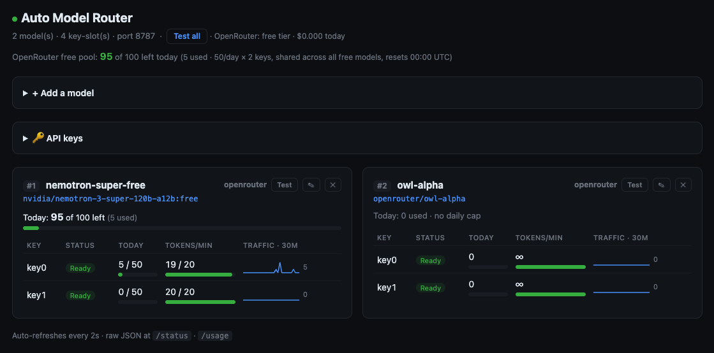

# Auto Modal



A local proxy that **automatically switches models AND API keys when a usage/rate
limit is exceeded**. Each model has a pool of keys; when a model+key returns `429`
(rate limit) or `402` (out of credits), the router cools that slot down and rotates
to the next **key**, then the next **model** — transparently, in the same request.
It only fails once *every key of every model* is spent.

It speaks **both** API dialects from one endpoint:

| Client | API it expects | Router endpoint |
|---|---|---|
| **Continue**, OpenAI SDKs, curl | OpenAI | `/v1/chat/completions`, `/v1/completions` |
| **Claude Code CLI** | Anthropic | `/v1/messages` (translated ⇄ OpenAI) |

```
client ──► router ──►  nemotron-free (OpenRouter)  key0 →429→ key1 →429→ ┐
                       owl-alpha     (OpenRouter)  key0 →429→ key1 →429→ ┤ rotate key,
                       qwen-72b      (HuggingFace) key0 ✅              ◄┘ then model
```

---

## Features

- **Model + key rotation** on `429` / `402` / network errors — each model holds a
  key pool; a limited key is skipped and the next (even a different account) is tried.
- **Per-day caps** — counts requests per `(model, key)` (persisted to `usage.json`)
  and proactively skips a slot at its `dailyLimit`.
- **Per-minute rate limit** — a token bucket per slot (`rpm`) rotates *before* the
  upstream returns `429`, smoothing load.
- **Cooldown** — a slot that just hit a limit is skipped for `cooldownMs`.
- **Transient retries** — `5xx` / timeouts retry the same slot before rotating.
- **Streaming** (SSE) and non-streaming, on every endpoint.
- **Two API dialects** — OpenAI (Continue) and Anthropic (Claude Code), same routing.
- **Live dashboard** — add/test/edit/reorder/delete models, add/remove keys, watch
  per-slot usage, sparklines, and the real OpenRouter free-pool — all hot-reloaded.

---

## Quick start (global, via npx)

One global config in `~/.auto-modal`, used everywhere — no install, no per-project setup:

```bash
npx -y @prakashpro1/auto-modal init     # creates ~/.auto-modal/{config.yaml,.env}
#  → add your OpenRouter / HF keys to ~/.auto-modal/.env  (or the dashboard 🔑 panel)
npx @prakashpro1/auto-modal             # start the router → http://localhost:8787
npx @prakashpro1/auto-modal claude      # launch Claude Code through it
```

Run it from any directory — with no `./.auto-modal` around, it always uses the global
`~/.auto-modal`. npx caches the package after the first download, so later runs are fast.

### Prefer a short command? Install globally once
```bash
npm install -g @prakashpro1/auto-modal   # → `automodal` on your PATH
automodal init                           # ~/.auto-modal/{config.yaml,.env}
automodal                                # start (type `automodal`, not the full npx line)
```

Commands (run from anywhere — prefix with `npx @prakashpro1/auto-modal` if not installed globally):
| Command | Does |
|---|---|
| `automodal` / `automodal start` | start the router (auto-kills any stale instance first) |
| `automodal claude [args]` | launch Claude Code through the router |
| `automodal init` | create the global `~/.auto-modal` config |
| `automodal where` | print which config / `.env` / `usage.json` is in effect |
| `automodal --help` | usage |

Config lives in **`~/.auto-modal`** (override with `AUTOMODAL_HOME`). The CLI never
writes inside the package. *(Advanced: a `./.auto-modal` dir in the current folder
overrides the global one — handy if you ever want a project-specific chain. Create it
with `automodal init --local`.)*

## Setup (from source / dev)

```bash
cd <path-to-automodal>
npm install
cp .env.example .env          # add your keys (comma-separated for multiple)
npm start                     # → http://localhost:8787
```

`.env`:
```bash
OPENROUTER_API_KEYS=sk-or-1...,sk-or-2...   # as many as you have; rotated automatically
HF_API_KEYS=hf_1...,hf_2...
```

Verify: `curl -s http://localhost:8787/health` → `{"ok":true,"models":N}`.
Open the dashboard at <http://localhost:8787/> to manage everything visually.

> `npm start` self-guards: a `prestart` hook kills any stale instance already on
> the port first, so you never end up with two routers fighting over state. Use
> `npm run restart` to force a clean restart.

---

## Use it with Continue (VS Code)

Add to `~/.continue/config.yaml`:
```yaml
models:
  - name: Pro Model
    provider: openai
    model: auto                 # router picks the model (chain + rotation)
    apiBase: http://localhost:8787/v1
    apiKey: dummy               # router holds the real keys
    roles: [chat, edit, apply, autocomplete]
```
- Skip `embed` / `rerank` — the router proxies completions only; use separate models.
- **Autocomplete** uses `/v1/completions`, routed the same way.
- **Images:** point a dedicated entry at a vision model with `capabilities: [image_input]`
  (free text models can't accept images). Route it through the router with
  `model: <vision-chain-id>` to keep key rotation.

---

## Use it with Claude Code CLI

Claude Code speaks the **Anthropic Messages API**; the router exposes `POST /v1/messages`
(+ `/v1/messages/count_tokens`) and translates request/response/streaming-SSE and tool
calls ⇄ OpenAI, then routes through the same chain.

**Prerequisites:** the global config set up (`automodal init`) with keys in
`~/.auto-modal/.env`, and the `claude` CLI installed.

### Step 1 — Start the router (Terminal A)
```bash
automodal                                    # or: npx @prakashpro1/auto-modal
curl -s http://localhost:8787/health         # → {"ok":true,"models":N}
```

### Step 2 — Launch Claude Code through the router (Terminal B)
```bash
automodal claude                             # interactive
automodal claude -p "explain this repo"      # headless / one-shot
#  npx form: npx @prakashpro1/auto-modal claude
```
`automodal claude` sets these **for that invocation only** (your normal `claude`
stays on real Anthropic):
```bash
ANTHROPIC_BASE_URL=http://localhost:8787
ANTHROPIC_AUTH_TOKEN=dummy        # router holds the real provider keys
ANTHROPIC_MODEL=auto              # full chain + rotation
ANTHROPIC_SMALL_FAST_MODEL=auto
```
Prefer manual env vars? Export the four above and run `claude`.

### Step 3 (optional) — Pick a model
- **Auto chain** (default): `ANTHROPIC_MODEL=auto` — rotates models + keys.
- **Pin one**: `ANTHROPIC_MODEL=claude-owl-alpha automodal claude` — the router
  strips the `claude-` prefix to match a chain id.
- **Switch in-session**: `CLAUDE_CODE_ENABLE_GATEWAY_MODEL_DISCOVERY=1 automodal claude`,
  then type `/model` and pick a `claude-<id>` entry (advertised via `GET /v1/models`).

### Step 4 — Watch it work
Open <http://localhost:8787/> while you use Claude Code — requests land on slots,
sparklines grow, daily/free-pool counters tick.

### Sanity test
```bash
automodal claude -p "What is 2+2? Reply with just the number."   # → 4
```

### Troubleshooting
| Symptom | Fix |
|---|---|
| `✗ Router not reachable` | Start the router (Step 1). |
| `overloaded_error` / 529 | All slots exhausted (e.g. free daily pool spent) — add a key in the 🔑 dashboard, or wait for 00:00 UTC. |
| Flaky tool calls / odd multi-step | Expected on free models — pin a tool-capable one (`claude-owl-alpha`). |

> ⚠️ Claude Code is tuned for Claude models (heavy agentic tool use, big context).
> Free OpenRouter/HF models connect and respond but are far weaker at tool calling
> and long agent loops — a "make it work" path, not Claude parity.

---

## Dashboard (`GET /`)

Auto-refreshes every 2s. One card per model, a row per key-slot.

- **Add a model** — searchable picker pulling each provider's live catalog
  (filter to free, sorted by context); ID + key-env auto-filled. Active free
  OpenRouter models auto-set `dailyLimit` from your account tier.
- **🔑 API keys** — list (masked) / add / remove keys; writes `.env`, hot-reloads,
  activates key-less models instantly.
- **Drag-to-reorder** priority · **Test** / **Test all** (real ping, ok/latency) ·
  **Edit** `rpm`/`dailyLimit` inline · **Delete**.
- **Per-slot sparkline** (last 30 min) + **"Today: N of T left"** per model.
- **OpenRouter free pool** header — the real shared cap (50/day free tier, 1000/day
  once ≥10 credits bought) summed across all `:free` models.

All edits write `config.yaml` / `.env` and hot-reload — no restart. (Dashboard edits
normalize `config.yaml` and drop inline comments.)

---

## API endpoints

| Endpoint | Purpose |
|---|---|
| `POST /v1/chat/completions` | OpenAI chat (Continue chat/edit/apply) |
| `POST /v1/completions` | OpenAI text/FIM (Continue autocomplete) |
| `POST /v1/messages` | Anthropic Messages (Claude Code), translated |
| `POST /v1/messages/count_tokens` | Token estimate for Claude Code |
| `GET /v1/models` | Chain as model list (+ `claude-<id>` aliases) |
| `GET /` | Live dashboard |
| `GET /status` | Chain + live usage (powers the dashboard) |
| `GET /usage` | Raw per-slot counts + cooldown |
| `GET /health` | Liveness + model count |
| `GET /admin/credits` | OpenRouter tier + credit usage + derived free cap |
| `GET /admin/catalog?provider=` | Live provider model catalog (picker) |
| `POST/PATCH/DELETE /admin/models[...]` | Add / edit / delete / reorder / test models |
| `GET/POST/DELETE /admin/keys` | Manage key pools |

Response headers: `X-Router-Model`, `X-Router-Key`, `X-Router-Upstream` reveal which
slot answered. Slots in `/usage` are labelled `modelId#keyIndex`.

---

## How "limit exceeded" is detected

| Upstream status | Action |
|---|---|
| `429`, `402` | cool down this `(model, key)` → **rotate key, then model** |
| `500/502/503/504` | retry same slot (`transientRetries`), then rotate |
| `404` | endpoint unsupported by this slot → rotate (don't fail) |
| other `4xx` | return to client (won't be fixed by switching) |
| `2xx` | success → record usage for that `(model, key)` |

---

## Configuration (`config.yaml`)

```yaml
port: 8787
cooldownMs: 3600000        # how long a limited slot rests
transientRetries: 2        # retries on 5xx/timeout before rotating
chain:                     # order = priority
  - id: nemotron-super-free
    provider: openrouter   # "openrouter" | "huggingface"
    model: nvidia/nemotron-3-super-120b-a12b:free
    apiKeys: ${OPENROUTER_API_KEYS}   # one env var, comma-separated, rotated
    dailyLimit: 50         # per key (optional)
    rpm: 20                # per-key requests/min token bucket (optional)
```

**Requesting a specific model:** if a request's `model` matches a chain **id** or
**slug** (or `claude-<id>`), it routes to just that model (keeping key rotation);
`auto`/unknown uses the full chain.

**Env overrides:** `ROUTER_CONFIG`, `ROUTER_ENV`, `ROUTER_USAGE` relocate
`config.yaml` / `.env` / `usage.json`.

---

## Notes

- Daily counters roll over at **UTC midnight**.
- OpenRouter free limit is **per key, shared across all `:free` models** — the
  dashboard's free-pool line reflects this real cap; per-model `dailyLimit` is what
  the router itself enforces to rotate early.
- Token buckets and request history are in-memory (reset on restart); daily counts
  and cooldowns persist in `usage.json`.

## Development

```bash
npm test     # 10 integration test suites (routing, rotation, rpm, limits,
             # completions, admin/keys/reorder/edit, history, Anthropic /v1/messages)
npm run dev  # auto-restart on change
```
